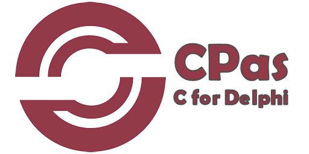

<a href="https://tinybiggames.com" target="_blank"></a>

[](https://discord.gg/tPWjMwK) [](https://github.com/tinyBigGAMES/CPas/stargazers) [](https://github.com/tinyBigGAMES/CPas/network/members) [](https://github.com/tinyBigGAMES/CPas/network/members)
[](https://twitter.com/tinyBigGAMES)

## Overview
What if you were able to load and use C99 sources directly from Delphi? There is a vast quantity of C libraries out there and being able to take advantage of them, without being a pain would be nice. You could even compile a bunch of sources and save them as a library file, then load them back in from disk, a resource or even from a stream. You can get the symbols, map to a C routine, and execute from the Delphi side all from a simple API.

## Downloads
<a href="https://github.com/tinyBigGAMES/CPas/releases" target="_blank">**Releases**</a> - These are the official release versions.

## Features
- **Free** for commercial use. See <a href="https://github.com/tinyBigGAMES/CPas/blob/main/LICENSE" target="_blank">License agreement</a>.
- Allow C integration with <a href="https://www.embarcadero.com/products/Delphi" target="_blank">Delphi</a> and <a href="https://www.freepascal.org/" target="_blank">FreePascal</a> at run-time.
- Support Windows 64-bit platform.
- Support for C99.
- Fast run-time compilation.
- Can run C sources directly or compile to (**.LIB**, **.EXE**, **.DLL**).
- Library files can be loaded and used at run-time from a file, a resource or stream.
- Import symbols directly from a dynamic linked library (**.DLL**) or module-definition (**.DEF**) file.
- You can reference the symbols from Delphi and directly access their value (mapping to a routine and data).
- Your application can dynamically or statically link to CPas.
- Direct access to the vast quantity of C99 libraries inside Delphi.

## Minimum System Requirements
- Delphi 10 (Win64 target only)
- FreePascal 3.3.3 (Win64 target only)
- Microsoft Windows 10, 64-bits
- 20MB of free hard drive space

## How to use in Delphi
- Unzip the archive to a desired location.
- Add `installdir\sources`, folder to Delphi's library path so the CPas source files can be found for any project or for a specific project add to its search path.
- Add `installdir\bin`, folder to Windows path so that `CPas.dll` file can be found for any project or place beside project executable.
- See examples in `installdir\examples` for more information about usage.
- You must include `CPas.dll` in your project distribution when dynamically linked to CPas. See `CPAS_STATIC` define in the CPas unit file.
- See `installdir\docs` for documentation.

**NOTE:** For your assurance and peace of mind, all official executables in the CPas distro that were created by us are code signed by **tinyBigGAMES LLC**. 

## A Tour of CPas
### CPas API
You access the easy to use API in Delphi from the `CPas` unit.
```pascal

{.$DEFINE CPAS_STATIC} //<-- define for static distribution

type
  { TCPas }
  TCPas = type Pointer;

  { TCPasOutput }
  TCPasOutput = (cpMemory, cpLib, cpEXE, cpDLL);

  { TCPasExe }
  TCPasExe = (cpConsole, cpGUI);

  { TCPasErrorMessageEvent }
  TCPasErrorEvent = procedure(aSender: Pointer; const aMsg: WideString);

{ Misc }
function  cpVersion: WideString;

{ State management }
function  cpNew: TCPas;
procedure cpFree(var aCPas: TCPas);
procedure cpReset(aCPas: TCPas);

{ Error handling }
procedure cpSetErrorHandler(aCPas: TCPas; aSender: Pointer; aHandler: TCPasErrorEvent);
procedure cpGetErrorHandler(aCPas: TCPas; var aSender: Pointer; var aHandler: TCPasErrorEvent);

{ Preprocessing }
procedure cpDefineSymbol(aCPas: TCPas; const aName: WideString; const aValue: WideString);
procedure cpUndefineSymbol(aCPas: TCPas; const aName: WideString);
function  cpAddIncludePath(aCPas: TCPas; const aPath: WideString): Boolean;
function  cpAddLibraryPath(aCPas: TCPas; const aPath: WideString): Boolean;

{ Compiling }
procedure cpSetOuput(aCPas: TCPas; aOutput: TCPasOutput);
function  cpGetOutput(aCPas: TCPas): TCPasOutput;
procedure cpSetExe(aCPas: TCPas; aExe: TCPasExe);
function  cpGetExe(aCPas: TCPas): TCPasExe;
function  cpAddLibrary(aCPas: TCPas; const aName: WideString): Boolean;
function  cpAddFile(aCPas: TCPas; const aFilename: WideString): Boolean;
function  cpCompileString(aCPas: TCPas; const aBuffer: string): Boolean;
procedure cpAddSymbol(aCPas: TCPas; const aName: WideString; aValue: Pointer);
function  cpLoadLibFromFile(aCPas: TCPas; const aFilename: WideString): Boolean;
function  cpLoadLibFromResource(aCPas: TCPas; const aResName: WideString): Boolean;
function  cpLoadLibFromStream(aCPas: TCPas; aStream: TStream): Boolean;
function  cpSaveOutputFile(aCPas: TCPas; const aFilename: WideString): Boolean; 
function  cpRelocate(aCPas: TCPas): Boolean;
function  cpRun(aCPas: TCPas): Boolean;
function  cpGetSymbol(aCPas: TCPas; const aName: WideString): Pointer;

{ Stats }
procedure cpStartStats(aCPas: TCPas);
function  cpEndStats(aCPas: TCPas; aShow: Boolean): WideString;

{ Resources }
procedure cpSetExeIcon(aCPas: TCPas; const aFilename: WideString);
function  cpGetExeIcon(aCPas: TCPas): WideString;
procedure cpSetAddVersionInfo(aCPas: TCPas; aAddVersionInfo: Boolean);
function  cpGetAddVersionInfo(aCPas: TCPas): Boolean;
procedure cpSetVersionInfo(aCPas: TCPas; const aCompanyName: WideString;
  const aFileVersion: WideString; const aFileDescription: WideString;
  const aOriginalFilename: WideString; const aLegalCopyright: WideString;
  const aComments: WideString);
procedure cpGetVersionInfo(aCPas: TCPas; var aCompanyName: WideString;
  var aFileVersion: WideString; var aFileDescription: WideString;
  var aOriginalFilename: WideString; var aLegalCopyright: WideString;
  var aComments: WideString);

```
If you want CPas to be statically bound to your application, enable the `{$CPAS_STATIC}` define in the CPas unit.

### How to use
A minimal implementation example:
```pascal
uses
  System.SysUtils,
  CPas;

var
  c: TCPas;
  
// CPas error handler
procedure ErrorHandler(aSender: Pointer; const aMsg: WideString);
begin
  WriteLn(aMsg);
end;  
  
begin
  // create a CPas instance
  c := cpNew;
  try
    // setup the error handler
    cpSetErrorHandler(c, nil, ErrorHandler);
    
    // add source file
    cpAddFile(cp, 'test1.c');

    // link and call main
    cpRun(cp);
  finally
    // destroy CPas instance
    cpFree(c);
  end;
end.
```
See the examples for more information on usage.

## Compatibility
A curated <a href="https://github.com/tinyBigGAMES/cpLibs" target="_blank">repo</a> of compatible libraries for CPas.

## Media

https://user-images.githubusercontent.com/69952438/156104143-bffb6c25-7bfa-4697-8413-4ac1740323cd.mp4


https://user-images.githubusercontent.com/69952438/156843415-f6566612-e7d8-41d6-bc3a-a76977cb95ee.mp4


## Support
<table>
<tbody>
	<tr>
		<td>Project Discussions</td>
		<td><a href="https://github.com/tinyBigGAMES/CPas/discussions">https://github.com/tinyBigGAMES/CPas/discussions</a></td>
	</tr>
	<tr>
		<td>Project Tracking</td>
		<td><a href="https://github.com/tinyBigGAMES/CPas/projects">https://github.com/tinyBigGAMES/CPas/projects</a></td>
	</tr>	
	<tr>
		<td>Website</td>
		<td><a href="https://tinybiggames.com">https://tinybiggames.com</a></td>
	</tr>
	<tr>
		<td>E-Mail</td>
		<td><a href="mailto:support@tinybiggames.com">support@tinybiggames.com</a></td>
	</tr>
	<tr>
		<td>Discord</td>
		<td><a href="https://discord.gg/tPWjMwK">https://discord.io/tinyBigGAMES</a></td>
	</tr>
	<tr>
		<td>Twitter</td>
		<td><a href="https://twitter.com/tinyBigGAMES">https://twitter.com/tinyBigGAMES</a></td>
	</tr>
	<tr>
		<td>Facebook</td>
		<td><a href="https://facebook.com/tinyBigGAMES">https://facebook.com/tinyBigGAMES</a></td>
	</tr>
	<tr>
		<td>YouTube</td>
		<td><a href="https://youtube.com/tinyBigGAMES">https://youtube.com/tinyBigGAMES</a></td>
	</tr>
</tbody>
</table>

## Sponsor
If this project has been useful to you, please consider sponsoring to help with it's continued development. **Thank You!** :clap:

<a href="https://www.buymeacoffee.com/tinybiggames"></a>

<p align="center">
 <a href="https://www.embarcadero.com/products/delphi" target="_blank"></a><br/>
 <b>❤ Made in Delphi</b>
</p>

